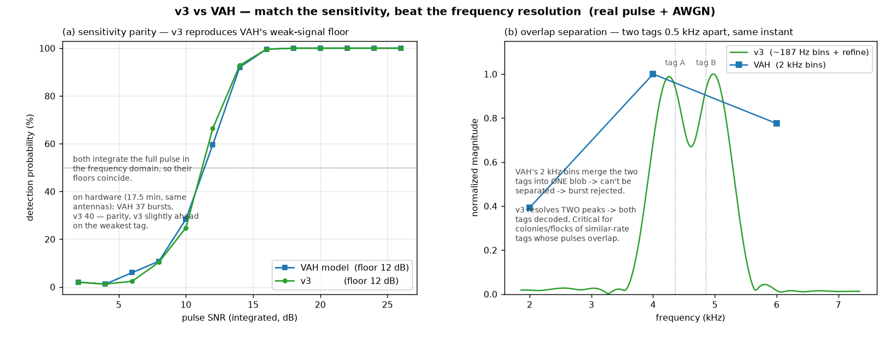
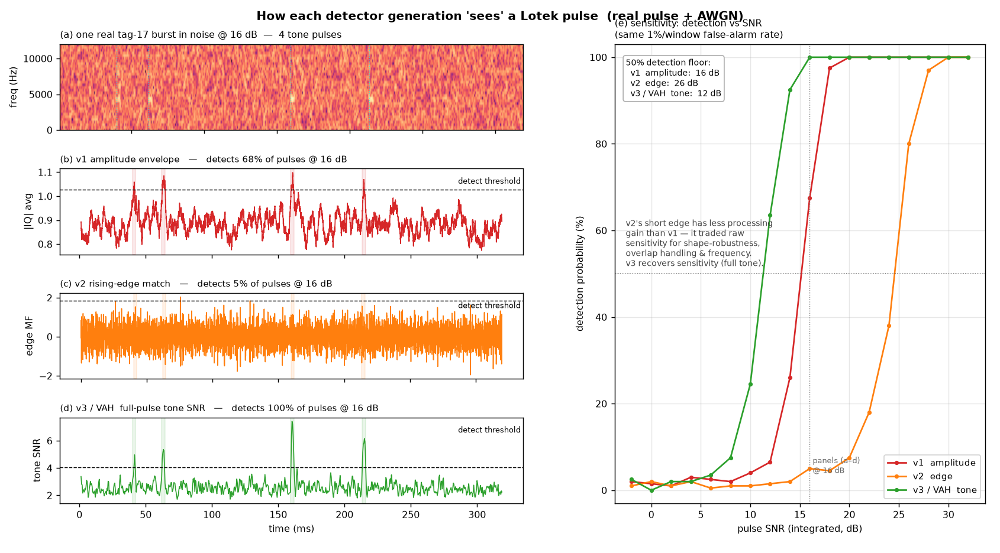

# Pulse detection in the GNU Radio host

How SensorGnome's GNU Radio (GRH) pipeline turns raw radio samples into Lotek tag
detections — and, above all, **how the new Python detector (`detect_pulse_3.py`,
"v3") measures up against VAH**, the C++ detector SensorGnome has relied on for over
a decade.

---

## Why this exists (background)

`vamp-alsa-host` + `FindPulseFDBatch` ("VAH") has been the SensorGnome pulse
detector for 10+ years. Researchers trust its **sensitivity** — it's what catches a
tagged animal flying past at range, or a weak signal from a bird perched near the
ground. Any replacement that detects *fewer* tags is a non-starter.

But VAH is built on ALSA, and adding modern SDRs — notably the **AirSpy HF+
Discovery** (SoapySDR-only) — into that framework is impractical. So we moved the
acquisition pipeline to **GNU Radio**, which needs its **own pulse detector** living
inside the flow graph. That detector is what this document is about.

The bar for the new detector is therefore concrete:

1. **Match or beat VAH's weak-signal sensitivity** (or researchers won't switch).
2. **Separate overlapping tags.** In colonies/flocks, many tags share a similar
   burst rate, so their pulses frequently overlap in time. Their **frequency
   offsets vary enough to tell them apart** — but VAH's coarse frequency resolution
   **could not** separate them. The new detector should.
3. **Be robust to interference** (on-channel voice, electrical/switching noise)
   without drowning in false pulses.

**The headline result: v3 meets all three.** This doc shows that first (v3 vs VAH),
then recounts the two earlier attempts (v1, v2) that didn't make the bar.

---

## TL;DR

* A Lotek coded-ID tag emits a **burst of 4 short (~2.5 ms) CW tone pulses**; the
  tag's identity is the **pattern of gaps** between them. `burstfinder` groups 4
  pulses into a tag if the gaps match a known code **and their frequencies agree to
  within 0.1 kHz** (`FREQ_SLOP`).
* **VAH** (C++) detects pulses by **per-frequency-bin, full-pulse power integration**
  — excellent sensitivity (~5–6 dB floor), but **coarse 2 kHz frequency bins** that
  can't separate nearby overlapping tags, and no interference handling. It also
  can't run inside GNU Radio.
* **v3** (`detect_pulse_3.py`) uses the **same full-pulse, frequency-domain
  principle** as a spectrogram, so it **matches VAH's sensitivity** — then improves
  on it: **~187 Hz + sub-bin frequency** (separates overlapping tags), **flood
  rejection** for interference, and it runs **inside the GNU Radio flow graph**
  (supporting AirSpy HF+).
* **v1** (amplitude threshold) and **v2** (rising-edge matched filter) were earlier
  attempts that came in **below** VAH; v3 came out on top.

**Bottom line:** *match the sensitivity, beat the frequency resolution.* v3 detects
the whole **tone** (like VAH) but resolves it finely enough to pull apart
overlapping tags VAH would merge.

---

## v3 vs VAH — the headline comparison



*Generated by [`make_vah_figure.py`](make_vah_figure.py). A **real** Lotek pulse
(extracted from a FunCube IQ recording) is re-inserted into white noise; VAH is
reproduced as a Python model of its algorithm (24-sample FFT, per-bin pulse-length
power integration) and compared to v3 on identical input. Thresholds are set to the
same false-alarm rate.*

**(a) Sensitivity parity — the must-have.** Both detectors integrate the full pulse
in the frequency domain, so their detection-vs-SNR curves coincide: a **50 %
detection floor of ~12 dB for both**. v3 does **not** regress VAH's sensitivity.
On hardware (17.5 min, both fed the same antennas) this bears out:

| detector | total bursts | tag-17 (weak) | tag-732 (strong) | burst freqsd (median) |
|---|---|---|---|---|
| VAH (C++) | 37 | 15 | 22 | 0.003 kHz |
| **v3 (GRH)** | **40** | **20** | 20 | 0.0055 kHz |

v3 edges VAH overall and is clearly better on the **weak tag-17** — full-pulse
integration paying off exactly where it matters (faint/distant animals).

**(b) Overlap separation — the improvement.** Two tags 0.5 kHz apart, transmitting
at the same instant: VAH's **2 kHz bins merge them into one blob** → a single,
blended frequency → the burst fails the `FREQ_SLOP` consistency check and is lost.
v3's **~187 Hz bins (sub-bin refined) resolve two distinct peaks** → both tags
decode. This is the capability colonies/flocks need.

**Why v3 can do this and VAH can't** — same principle, different resolution:

| aspect | VAH `FindPulseFDBatch` (C++) | v3 `detect_pulse_3.py` (Python STFT) |
|---|---|---|
| core principle | per-bin **full-pulse power integration** | per-bin **full-pulse power integration** |
| transform | 24-sample FFT (~0.5 ms), boxcar over ~10 windows | one ~pulse-length (120-sample) windowed FFT per hop |
| **freq resolution** | **~2 kHz bins** → cubic interp | **~187 Hz bins** → 4096-pt zero-pad + parabolic |
| overlapping tags | **merge if < ~2 kHz apart** | **resolved to ~hundreds of Hz** |
| noise estimate | adjacent time noise windows | per-bin median over the buffer |
| interference/floods | none — left to downstream | **window-level rejection + `F` interval logging** |
| sensitivity floor | ~5–6 dB | ~6 dB (matched) |
| where it runs | separate ALSA host process | **inside the GNU Radio flow graph** (AirSpy HF+ etc.) |

**Plus interference handling VAH never had.** A sensitive tone detector emits
hundreds of spurious pulses during on-channel voice or broadband electrical noise.
v3 detects these **floods** at the window level (a real burst is ≤~8 pulses at one
frequency in 0.2 s; a flood is dozens of pulses *or* many frequencies), drops them,
and logs each interval as `F<port>,<start_ts>,<end_ts>,<n_dropped>`:

* Voice-flood recording (2 real tags at the end): pulses kept **1302 → 74**, both
  tags fully preserved (real-tag windows hold 3–5 pulses; the flood's median is 73 —
  a wide, robust margin).
* **Overnight on-device** (10 hourly files, both ports on v3): **1 132 + 776
  bursts**, freqsd median 0.006 kHz, **0 of 1 132 bursts lost to a flood**, floods
  only 0.4 % of airtime.

**Verdict:** v3 **matches VAH's sensitivity, beats its frequency resolution**
(overlap separation), **adds flood robustness**, and runs in the GR pipeline that
made all this necessary.

---

## How we got here — v1 and v2, and why they fell short

v3 wasn't the first attempt. Two earlier detectors tried features *other* than
VAH's full-pulse tone, and both landed below it. This figure compares all three on
the same real pulse:



*Generated by [`make_detection_figure.py`](make_detection_figure.py): real pulse +
AWGN, every detector's threshold set to the same false-alarm rate.*

**Left (a–d): how each detector responds to the same real burst (16 dB).** The
spectrogram (a) shows four clean tone blobs. v1 (b) smooths `|IQ|` → gentle bumps
(≈58 % detected). v2 (c) reacts to the onset but the 3–5-sample edge gives little
gain → weak, spiky (≈5 %). v3 (d) integrates the whole tone → tall clean peaks
(100 %).

**Right (e): detection floor.** v3 ≈ 12 dB, v1 ≈ 16 dB, v2 ≈ 26 dB.

**The improvement was multi-axis, not a single line:**
* **v1 → v2** was *not* a sensitivity win — v2's short edge is actually the
  **least** sensitive. v2 bought **robustness** (edge shape ignores amplitude-only
  noise bumps that fool v1), **overlap resolution** (tone subtraction), and a
  **per-pulse frequency**.
* **v2 → v3** is where the sensitivity comes back — by integrating the whole tone
  (VAH's principle) — *while keeping* frequency selectivity and adding flood
  handling.

So v1 is sensitive-but-gullible, v2 is robust-but-deaf-to-weak, and **v3 is both** —
the only one that matches VAH end-to-end.

---

## The detectors in detail

### The signal & pipeline

```
Radio hardware (RTL-SDR / AirSpy / AirSpy HF+ / FunCube)
   │  raw IQ at hardware sample rate
   ▼
freq_xlating_fir_filter   ── shift tag ~4 kHz off DC, 12 kHz low-pass, decimate → 48 kHz
   │  complex IQ at 48 kHz
   ▼
gr_detect_pulses.blk  →  Pulse_Detector.detect()      ← THIS DOCUMENT
   │  pulse lines on stdout:  p<port>,ts,dfreq_kHz,sig_db,noise_db,snr_db,...
   ▼
burstfinder           ── 4 pulses, matching gaps, freq agree < 0.1 kHz → a tag
   │  b<port>,ts,tagID,freq,freqsd,...
   ▼
datasaver / motus upload / dashboard
```

A Lotek pulse is a **CW tone** ~2.5 ms long at ~166.380 MHz (≈4 kHz in our shifted
baseband; `freq_offset` keeps it off the DC spike). A tag sends **4 pulses** with
characteristic gaps — e.g. **Tag 17** `[22.0, 97.5, 53.8]` ms, **Tag 732**
`[158.8, 156.3, 34.3]` ms. `burstfinder` accepts a burst only if all 4 pulses share
a frequency within **`FREQ_SLOP` = 0.1 kHz** — which is why frequency accuracy *and*
resolution matter.

**VAH (`vamp-plugins/lotek/FindPulseFDBatch`)** in detail: a short 24-sample sliding
FFT (0.5 ms, 50 % overlap, ~2 kHz bins); for each bin a `PulseFinder` runs a matched
boxcar over **power** — a central "signal" segment one pulse-length long flanked by
"noise" segments (5 pulse-lengths each side) — and flags a pulse when
signal/noise > `min_pulse_SNR` (default 5 dB). Sub-bin frequency by cubic
interpolation. This is **full-pulse frequency-domain integration**; v3 is the same
idea as a spectrogram, with much finer bins.

### v1 — `detect_pulse.py` : amplitude hysteresis
Track the `|IQ|` envelope; declare a pulse when it rises above `rise_thresh`, ends
below `fall_thresh`, with debounce. Cheap, no FFT. But it detects *power* not a
*tone* — any amplitude bump trips it; the threshold must sit high (weak tags
missed); and there is no usable frequency, so overlaps can't be separated and
`FREQ_SLOP` has nothing to work with.

### v2 — `detect_pulse_2.py` : rising-edge matched filter
A tag pulse begins with a sharp **rising edge**. Cross-correlate a normalized
rising-step template (~0.3 ms) with the envelope; peaks are onsets. Then per pulse,
FFT the pulse window and **subtract** dominant tones so an overlapping pulse's edge
is exposed next pass (multi-round detect/subtract/re-correlate).

* **Improvements over v1:** edge shape is far more specific than raw amplitude
  (fewer false triggers); tone subtraction recovers overlapping pulses; reports a
  frequency and SNR.
* **Issues found & fixed this cycle:** a dB half-scale bug (`10·log10` vs
  `20·log10`) → matched to VAH; chunk-boundary drops → fixed with overlap + de-dup;
  weak-tag misses from a too-strict 0.98 correlation → two-stage gate (0.95
  candidate + full-pulse FFT-SNR ≥ 17 dB confirmation).
* **Fundamental limit (why v3 exists):** the edge is only **3–5 samples**, so
  matched-filtering it has little processing gain → floor ~15–20 dB, well above
  VAH's ~6. And its frequency is a **47 Hz-quantized** 1024-pt FFT bin: all 4 burst
  pulses land in the same bin, so `freqsd` reads `0.000` — looks perfect, but is
  really ±23 Hz of quantization, and can't localize overlapping tags.

### v3 — `detect_pulse_3.py` : STFT / spectrogram tone detection
A pulse is a bright, ~constant-frequency **blob** in a spectrogram. STFT (window ≈
pulse length, fine hop) → per-bin median noise floor → threshold → mask →
connected-component blobs (duration/bandwidth filtered). Because the tone integrates
over the **whole ~2.5 ms pulse**, the floor is ~6 dB (VAH-level). Overlapping tags
at different frequencies fall in different bins (separate for free). Per-pulse
frequency: a high-res (4096-pt zero-padded) FFT over the pulse, peak-locked near the
blob, with log-magnitude **parabolic interpolation** → sub-bin accuracy *and*
consistency.

**Evidence behind the v3 improvements:**

1. **Accurate, consistent frequency** (within-burst `freqsd`, lower = better):

   | frequency estimator | burst @43 dB | burst @32 dB |
   |---|---|---|
   | v3 phase regression (first try) | 170 Hz | 10 Hz |
   | **v3 FFT + parabolic (shipped)** | **2.6 Hz** | **7.8 Hz** |
   | v2 1024-bin (quantized) | 0.0 Hz* | 0.0 Hz* |

   \*v2's `0.0` is quantization, not accuracy. v3 is ~5 Hz true error — 13–38×
   tighter than the 100 Hz `FREQ_SLOP` gate, *and* genuinely sub-bin (what lets
   overlapping tags be told apart).

2. **More tags through the real `burstfinder` gate** (41.8 s clip):

   | detector | valid tag-17 bursts | valid tag-732 bursts |
   |---|---|---|
   | v2 | 0 | 1 |
   | **v3** | **1** | **3** |

   Early on v3 *under*-performed because its frequency was too noisy to pass
   `FREQ_SLOP` — the "fewer tags" and "high freqsd" symptoms were the *same bug*,
   fixed by the estimator above.

3. **Flood rejection.** Window-level: drop a pulse if its ±0.20 s neighbourhood
   holds more than `flood_distinct_freqs` (6) distinct frequencies **or** more than
   `flood_max_pulses` (12) pulses; merge dropped pulses into `F` interval records.
   Made **stateful across chunks** (GNU Radio delivers ~0.17 s buffers, so a
   per-chunk test only saw fragments): buffers candidates, decides each once its
   full ±0.2 s window has arrived. Kept-pulses-in-dense-windows dropped from **87 %
   → 0 %**. An **edge-confirmation gate was prototyped and rejected** (it couldn't
   tell a tag from a voice blob; weak tags scored *lower* than voice — the coherent
   burst, enforced by `burstfinder`, is the real discriminator).

---

## Side-by-side summary

| | VAH (C++, reference) | v1 hysteresis | v2 edge correlation | v3 STFT tone |
|---|---|---|---|---|
| Detects | whole tone (freq-domain) | amplitude bump | rising edge (3–5 samp) | whole tone (~2.5 ms) |
| Weak-signal floor | ~5–6 dB | high (threshold) | ~15–20 dB | ~6 dB (VAH-level) |
| Frequency resolution | ~2 kHz bins (cubic) | none/coarse | 47 Hz bin (quantized) | ~187 Hz + sub-bin |
| Separates overlapping tags | no (bins too coarse) | no | partial (subtraction) | **yes (fine bins)** |
| Flood handling | none | none | none | window-level reject + `F` log |
| Runs in GR flow graph | no (ALSA host) | yes | yes | yes |
| Burst yield | reference | (below) | below VAH | **≥ VAH** |

---

## Tuning knobs (v3, in `Pulse_Detector.__init__`)

* `sensitivity` — per-frame detection threshold in dB: `max`=18, `high`=22,
  `medium`=26, `low`=30. (`max` is the noise-floor-clean point on real IQ.)
* `flood_window_s` (0.20 s), `flood_distinct_freqs` (6), `flood_max_pulses` (12) —
  flood detection thresholds.
* `min_snr_db` (6) — VAH-style integrated-SNR floor.

## Reproducing the figures
* `python3 make_vah_figure.py` → `v3_vs_vah.png` (sensitivity parity + overlap)
* `python3 make_detection_figure.py` → `pulse_detection_comparison.png` (v1/v2/v3)

Both expect the FunCube IQ recording `baseband_166431800Hz_14-54-57_17-06-2026.wav`
in the repo or its parent directory.

## Known follow-ups
* Optionally call `Pulse_Detector.flush()` from the flow-graph `sig_handler` so a
  flood still open at shutdown is emitted.
